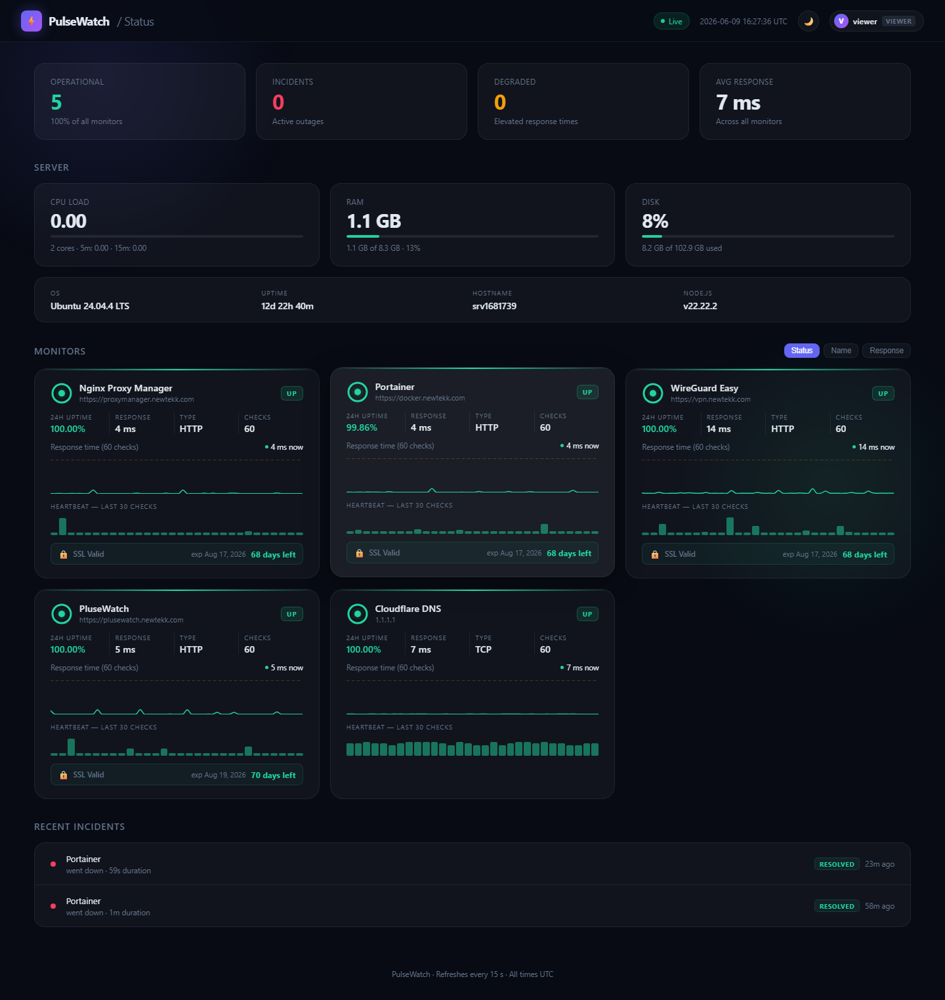
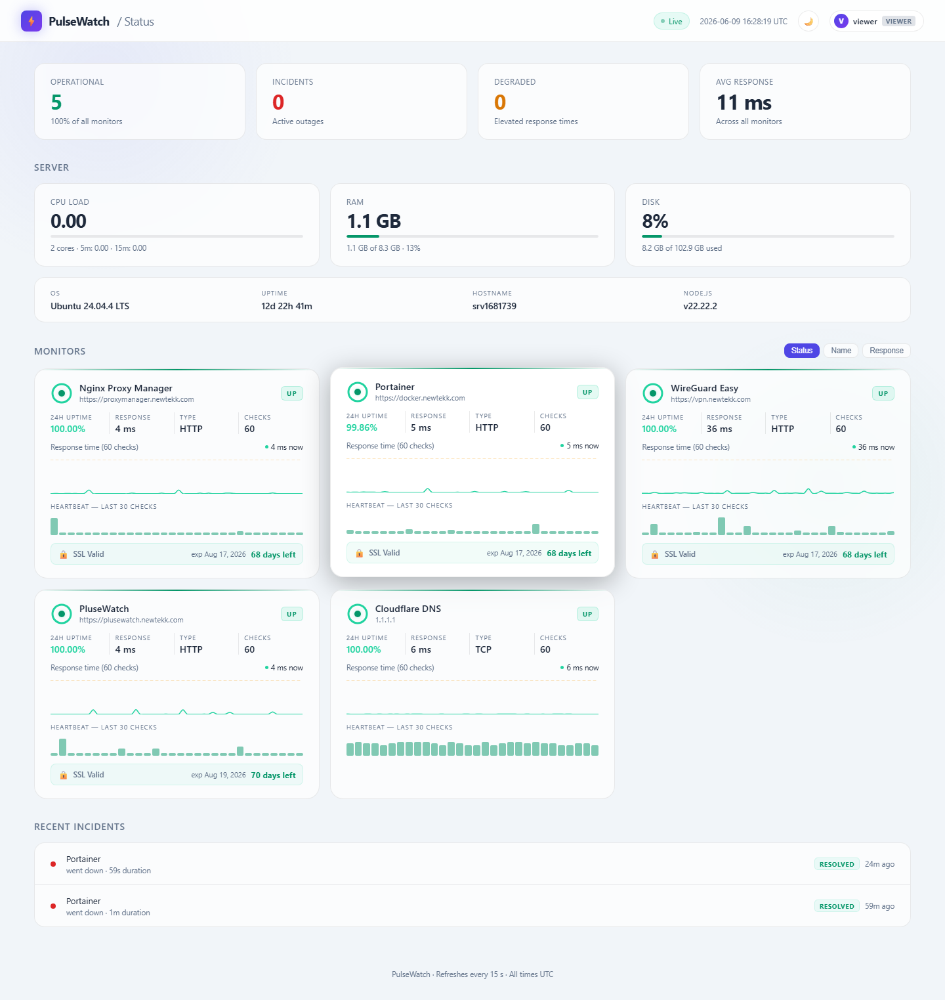

# PulseWatch

A self-hosted uptime and status dashboard. Monitor HTTP and TCP services with live status, response times, sparklines, SSL tracking, persistent check history, webhook alerting, and server stats.



## Features

- **Live monitoring** — HTTP and TCP checks on configurable intervals
- **Server stats** — live CPU load, RAM, disk usage, OS, uptime, and hostname
- **24h uptime %** — per-card uptime driven by SQLite, not a rolling buffer
- **Response time sparklines** — last 60 checks visualised per service card
- **Heartbeat bars** — at-a-glance uptime pattern for the last 30 checks
- **SSL certificate tracking** — days-remaining badge with warning / critical / expired states
- **Persistent history** — every check saved to SQLite; survives restarts; 30-day retention
- **History modal** — click any service card to view 24h / 7d / 30d charts and an uptime heatmap
- **Incident log** — DB-backed incident tracking with duration; persists across reloads
- **Webhook alerting** — Discord / Slack / generic webhooks on down, degraded, and recovery events
- **Maintenance windows** — schedule downtime per service to suppress alerts
- **Dark / light theme** — toggleable, preference saved in `localStorage`
- **Admin / viewer roles** — admins can add, edit, delete services, schedule maintenance, and manage webhooks
- **No npm dependencies** — Node.js stdlib + built-in `node:sqlite` only

## Screenshots

| | Dark | Light |
|---|---|---|
| **Dashboard** |  |  |

**Incident log**


## Tech stack

| Layer | Choice |
|---|---|
| Runtime | Node.js 22 — uses built-in `node:sqlite`, zero npm packages |
| Frontend | Vanilla JS + [Chart.js](https://www.chartjs.org/) (CDN) |
| Auth | `scrypt`-hashed passwords · bearer tokens · `sessionStorage` (24 hr) |
| Persistence | `config.json` (services + credentials + alert webhooks) · `history.db` (SQLite) |
| Deployment | systemd service, runs as `www-data` |

## Project structure

```
server.js         Node.js backend — monitoring engine + HTTP API
index.html        Single-page frontend — all UI in one file
setup.sh          One-command installer for Linux

# Created at runtime, not in repo:
config.json       Services list, port, intervals, hashed passwords, alert webhooks
maintenance.json  Maintenance window state
history.db        SQLite — check history + incident log (30-day rolling)
```

## Quick start

### Requirements

- Linux server (Ubuntu/Debian or RHEL/Rocky/CentOS)
- Node.js 22+

### Install

```bash
git clone https://github.com/jerryhobson-datageek/plusewatch.git
cd plusewatch
chmod +x setup.sh
sudo ./setup.sh
```

The installer will:
- Install Node.js 22 if needed
- Deploy files to `/opt/pulsewatch/`
- Register and start a `systemd` service on port 3000

Once running, open `http://YOUR_SERVER_IP:3000` in your browser. Cards show live status within 30 seconds.

### Default credentials

| Username | Password | Role |
|---|---|---|
| `admin` | `admin123` | Admin — full access |
| `viewer` | `viewer123` | Viewer — read-only |

> **Change these immediately after first login** — click your username in the top-right corner → Change Password.

## Service configuration

Services can be managed through the Admin UI (Services section on the dashboard) or by editing `/opt/pulsewatch/config.json` directly.

### Config options

| Field | Required | Description |
|---|---|---|
| `id` | Yes | Unique integer |
| `name` | Yes | Display name |
| `url` | Yes | Full URL for HTTP/HTTPS, or `host:port` for TCP |
| `type` | Yes | `HTTP` or `TCP` |
| `interval` | No | Check interval in seconds (default: global or 30) |
| `degradedThreshold` | No | RT in ms above which status turns yellow |
| `timeout` | No | Request timeout in ms (default: 5000) |
| `sslCheck` | No | Set `false` to disable SSL tracking for an HTTPS service |

## Webhook alerting

Add webhooks via the Admin UI (Alert Webhooks section). Discord, Slack, and generic HTTP endpoints are supported. Each webhook can be configured to fire on **Down**, **Degraded**, and/or **Recovery** events.

Discord webhook URLs (`discord.com/api/webhooks/…`) receive rich embeds with colour-coded status. All other URLs receive a generic JSON payload compatible with Slack incoming webhooks.

A per-service cooldown (default 300 s) prevents alert spam when a service flaps.

## API

| Method | Path | Auth | Description |
|---|---|---|---|
| `POST` | `/api/login` | — | Obtain a bearer token |
| `POST` | `/api/logout` | any | Invalidate token |
| `GET` | `/api/me` | any | Current user info |
| `GET` | `/api/status` | any | Live state for all services |
| `GET` | `/api/history/:id?range=24h\|7d\|30d` | any | Bucketed check history from SQLite |
| `GET` | `/api/incidents` | any | Recent incident log |
| `GET` | `/api/sysinfo` | any | Server CPU, RAM, disk, OS, uptime |
| `GET` | `/api/services` | admin | List services |
| `POST` | `/api/services` | admin | Add a service |
| `PUT` | `/api/services/:id` | admin | Update a service |
| `DELETE` | `/api/services/:id` | admin | Remove a service |
| `GET` | `/api/maintenance` | any | List maintenance windows |
| `POST` | `/api/maintenance` | admin | Schedule a maintenance window |
| `DELETE` | `/api/maintenance/:id` | admin | Delete a maintenance window |
| `GET` | `/api/alerts` | admin | Get alert webhook config |
| `POST` | `/api/alerts/webhooks` | admin | Add a webhook |
| `PUT` | `/api/alerts/webhooks/:id` | admin | Update a webhook |
| `DELETE` | `/api/alerts/webhooks/:id` | admin | Remove a webhook |
| `POST` | `/api/alerts/test/:id` | admin | Send a test notification |
| `POST` | `/api/change-password` | any | Change own password |

## Service management

```bash
systemctl start pulsewatch
systemctl stop pulsewatch
systemctl restart pulsewatch
systemctl status pulsewatch
journalctl -u pulsewatch -f   # live logs
```

## Updating

```bash
# On the server
cd /root/plusewatch
git pull
cp server.js index.html /opt/pulsewatch/
systemctl restart pulsewatch
```
