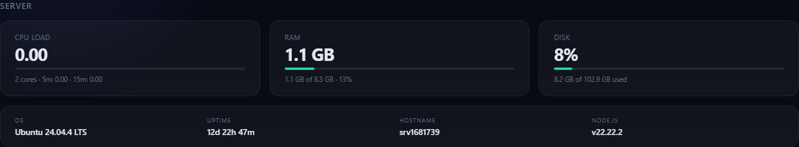
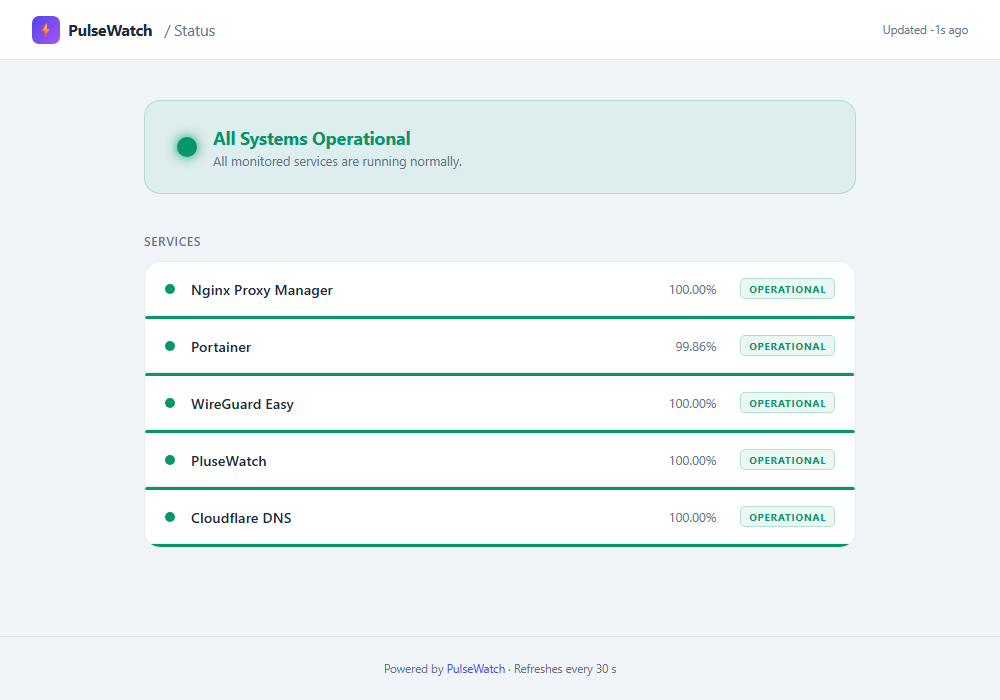
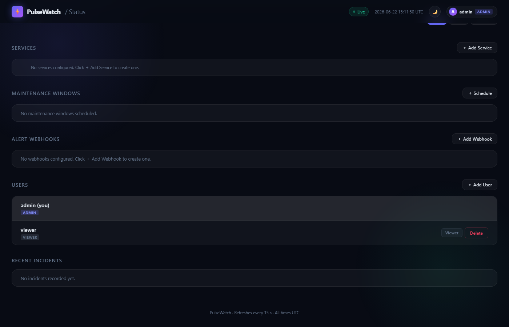
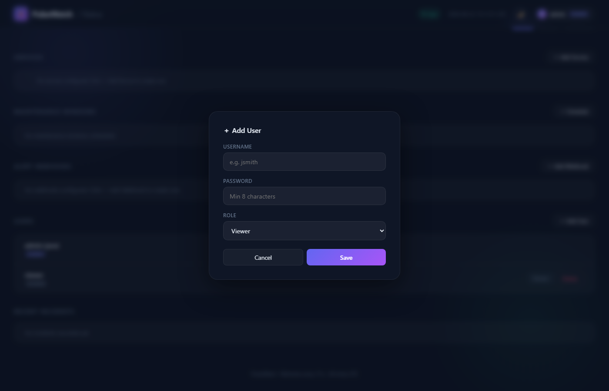

# PulseWatch

A self-hosted uptime and status dashboard. Monitor HTTP, TCP, and PING services with live status, response times, sparklines, SSL tracking, persistent check history, webhook alerting, and server stats.


## Features

- **Live monitoring** — HTTP, TCP, and PING checks on configurable intervals
- **Server stats** — live CPU load, RAM, disk usage, OS, uptime, and hostname
- **24h uptime %** — per-card uptime driven by SQLite, not a rolling buffer
- **Response time sparklines** — last 60 checks visualised per service card
- **Heartbeat bars** — at-a-glance uptime pattern for the last 30 checks
- **SSL certificate tracking** — days-remaining badge with warning / critical / expired states
- **Persistent history** — every check saved to SQLite; survives restarts; 30-day retention
- **History modal** — click any service card to view 24h / 7d / 30d charts and an uptime heatmap
- **Incident log** — DB-backed incident tracking with duration; persists across reloads
- **Webhook alerting** — Discord / Slack / generic webhooks on down, degraded, and recovery events
- **Maintenance windows** — schedule downtime per service to suppress alerts
- **Dark / light theme** — toggleable, preference saved in `localStorage`
- **Admin / viewer roles** — admins can add, edit, delete services, schedule maintenance, manage webhooks, and manage user accounts
- **Public status page** — shareable `/status` page, no login required
- **No npm dependencies** — Node.js stdlib + built-in `node:sqlite` only

## Screenshots

| | Dark | Light |
|---|---|---|
| **Dashboard** |  |  |

**PING monitor card**


**Server stats**



**Incident log**


**Public status page** (`/status` — no login required)



## Tech stack

| Layer | Choice |
|---|---|
| Runtime | Node.js 22 — uses built-in `node:sqlite`, zero npm packages |
| Frontend | Vanilla JS + [Chart.js](https://www.chartjs.org/) (CDN) |
| Auth | `scrypt`-hashed passwords · bearer tokens · `sessionStorage` (24 hr) |
| Persistence | `config.json` (services + credentials + alert webhooks) · `history.db` (SQLite) |
| Deployment | systemd service **or** Docker (`node:22-alpine`) |

## Project structure

```
server.js            Node.js backend — monitoring engine + HTTP API
index.html           Single-page frontend — all UI in one file
public.html          Public status page (no login required)
Dockerfile           node:22-alpine image
docker-compose.yml   Port, volume, NET_RAW capability for PING
setup.sh             One-command installer for Linux (non-Docker)

# Runtime files — not in repo, persist via volume or /opt/pulsewatch/:
config.json          Services, credentials, alert webhooks
maintenance.json     Maintenance window state
history.db           SQLite — check history + incident log (30-day rolling)
```

## Docker

```bash
git clone https://github.com/jerryhobson-datageek/plusewatch.git
cd plusewatch
docker compose up -d
```

Open `http://localhost:3000`. Default credentials (`admin / admin123`) are created automatically on first run — **change them immediately**.

### Data persistence

Runtime files are stored in `./data/` on the host and mounted into the container at `/data`. They persist across image rebuilds and container restarts.

```
./data/
  config.json       # services, credentials, alert webhooks
  maintenance.json  # maintenance windows
  history.db        # SQLite check history + incident log
```

### Environment variables

| Variable | Default | Description |
|---|---|---|
| `PORT` | `3000` | HTTP port the server listens on |
| `DATA_DIR` | `/data` (Docker) / app dir (bare) | Directory for runtime data files |

### PING checks in Docker

PING uses ICMP which requires the `NET_RAW` capability. This is already set in `docker-compose.yml`:

```yaml
cap_add:
  - NET_RAW
```

If running the container manually: `docker run --cap-add NET_RAW ...`

### Build and run manually

```bash
docker build -t pulsewatch .
docker run -d \
  --name pulsewatch \
  --restart unless-stopped \
  -p 3000:3000 \
  -v $(pwd)/data:/data \
  --cap-add NET_RAW \
  pulsewatch
```

## Quick start (without Docker)

### Requirements

- Linux server (Ubuntu/Debian or RHEL/Rocky/CentOS)
- Node.js 22+

### Install

```bash
git clone https://github.com/jerryhobson-datageek/plusewatch.git
cd plusewatch
chmod +x setup.sh
sudo ./setup.sh
```

The installer will:
- Install Node.js 22 if needed
- Deploy files to `/opt/pulsewatch/`
- Register and start a `systemd` service on port 3000

Once running, open `http://YOUR_SERVER_IP:3000` in your browser. Cards show live status within 30 seconds.

### Default credentials

| Username | Password | Role |
|---|---|---|
| `admin` | `admin123` | Admin — full access |
| `viewer` | `viewer123` | Viewer — read-only |

> **Change these immediately after first login** — click your username in the top-right corner → Change Password.

## Service configuration

Services can be managed through the Admin UI (Services section on the dashboard) or by editing `/opt/pulsewatch/config.json` directly.

### Config options

| Field | Required | Description |
|---|---|---|
| `id` | Yes | Unique integer |
| `name` | Yes | Display name |
| `url` | Yes | Full URL for HTTP/HTTPS · `host:port` for TCP · hostname or IP for PING |
| `type` | Yes | `HTTP`, `TCP`, or `PING` |
| `interval` | No | Check interval in seconds (default: global or 30) |
| `degradedThreshold` | No | RT in ms above which status turns yellow |
| `timeout` | No | Request timeout in ms (default: 5000) |
| `sslCheck` | No | Set `false` to disable SSL tracking for an HTTPS service |

## Public status page

A read-only status page is available at `/status` with no login required — safe to share with users or embed as a link in your app.

It shows the overall system status (All Systems Operational / Partial Outage / etc.), each service with its current status and 24h uptime %, and auto-refreshes every 30 seconds. Respects the visitor's system dark/light preference.

The underlying data is served from `GET /api/public/status` which also requires no authentication.

## Webhook alerting

Alerts fire when a service changes status. Each webhook can be configured to fire on **Down**, **Degraded**, and/or **Recovery** events. A per-service cooldown (default 300 s) prevents alert spam when a service flaps.

### Setting up Discord alerts

1. Open your Discord server → **Server Settings** → **Integrations** → **Webhooks**
2. Click **New Webhook**, give it a name and choose a channel, then click **Copy Webhook URL**
3. In PulseWatch, log in as admin and scroll to the **Alert Webhooks** section
4. Click **＋ Add Webhook**, paste the URL, set a name, choose which events to fire on, and click **Save**
5. Click **Test** on the new row — a test embed should appear in your Discord channel immediately

Discord webhook URLs (`discord.com/api/webhooks/…`) automatically receive rich embeds with colour-coded status and response time. All other URLs receive a generic JSON payload compatible with Slack incoming webhooks.

> **Security:** treat your webhook URL like a password — it allows anyone to post to that channel. If it's ever exposed, regenerate it in Discord and update PulseWatch via the Edit button.

### Consecutive failure threshold

By default PulseWatch alerts on the first failure. To require N consecutive failures before alerting (avoiding false positives from transient blips), set **Alert after N failures** when adding or editing a service in the admin UI. The card will show a dimmed `1/3` → `2/3` counter while below the threshold.

## User management



Admins can manage accounts from the **Users** section on the dashboard, no SSH required.



- **Add a user** — click **＋ Add User**, set a username, password (min. 8 characters), and role (`admin` or `viewer`)
- **Change a role** — click the role toggle on a user's row to flip between admin and viewer
- **Remove a user** — click **Delete** on their row; their active sessions are invalidated immediately
- Admins cannot change their own role or remove their own account, to prevent accidental lockout

## API

| Method | Path | Auth | Description |
|---|---|---|---|
| `POST` | `/api/login` | — | Obtain a bearer token |
| `POST` | `/api/logout` | any | Invalidate token |
| `GET` | `/api/me` | any | Current user info |
| `GET` | `/api/status` | any | Live state for all services |
| `GET` | `/api/history/:id?range=24h\|7d\|30d` | any | Bucketed check history from SQLite |
| `GET` | `/api/incidents` | any | Recent incident log |
| `GET` | `/api/sysinfo` | any | Server CPU, RAM, disk, OS, uptime |
| `GET` | `/api/services` | admin | List services |
| `POST` | `/api/services` | admin | Add a service |
| `PUT` | `/api/services/:id` | admin | Update a service |
| `DELETE` | `/api/services/:id` | admin | Remove a service |
| `GET` | `/api/maintenance` | any | List maintenance windows |
| `POST` | `/api/maintenance` | admin | Schedule a maintenance window |
| `DELETE` | `/api/maintenance/:id` | admin | Delete a maintenance window |
| `GET` | `/api/alerts` | admin | Get alert webhook config |
| `POST` | `/api/alerts/webhooks` | admin | Add a webhook |
| `PUT` | `/api/alerts/webhooks/:id` | admin | Update a webhook |
| `DELETE` | `/api/alerts/webhooks/:id` | admin | Remove a webhook |
| `POST` | `/api/alerts/test/:id` | admin | Send a test notification |
| `POST` | `/api/change-password` | any | Change own password |
| `GET` | `/api/users` | admin | List users |
| `POST` | `/api/users` | admin | Add a user |
| `PATCH` | `/api/users/:username` | admin | Change a user's role |
| `DELETE` | `/api/users/:username` | admin | Remove a user |

## Service management

```bash
systemctl start pulsewatch
systemctl stop pulsewatch
systemctl restart pulsewatch
systemctl status pulsewatch
journalctl -u pulsewatch -f   # live logs
```

## Updating

```bash
# On the server
cd /root/plusewatch
git pull
cp server.js index.html /opt/pulsewatch/
systemctl restart pulsewatch
```
